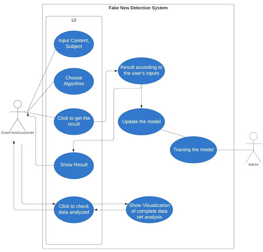

# Fake-News-Detection-with-NLP (Team - 5)

Use Case:

Project Flow:
       . A Interactive page to accept the user input
       . A well trained model to analyze the characteristics
       . A higher probability output of the data provided

Text to TFIDF:

    Extract tokens from title 
    Remove stop words from title
    Compute Term frequency from title
    Compute Term frequency-inverse document frequency from title
    Extract tokens from text
    Remove stop words from text
    Compute Term frequency from text
    Compute Term frequency-inverse document frequency text
    StringIndexer subject

Employed Random Forest & Naive Bayes modeling
